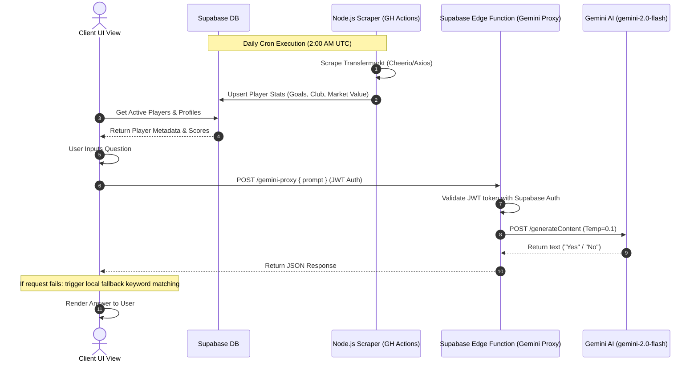

# Football Genius — Football Trivia Game

[](https://www.footygen.online/)
[](#-core-engineering--pipeline-highlights)

**Football Genius** is a production-grade, cloud-native football trivia and interactive game hub designed for football enthusiasts. It showcases automated data-scraping pipelines, secure distributed authentication, real-time multiplayer lobbies, and an intelligent LLM agent engine powered by Google Gemini.

---

## Visual Preview

<p align="center">
  
</p>

---

## Core Engineering & Pipeline Highlights

The system architecture is structured to operate with minimal manual intervention, leveraging scheduled automation, serverless database synchronization, robust caching, and intelligent client-side fallbacks.



### 1. Autonomous Data Automation

The project runs an automated data-scraping and database synchronization pipeline that maintains up-to-date player profiles, transfer values, and career statistics:

* **Orchestration**: A GitHub Actions workflow [update-stats.yml](https://www.google.com/search?q=.github/workflows/update-stats.yml) executes on a serverless cron job daily at **2:00 AM UTC** (`0 2 * * *`) and supports manual workflow triggers (`workflow_dispatch`).
* **Scrape Mechanics**: The Node.js worker [update-stats.js](https://www.google.com/search?q=scripts/update-stats.js) queries Transfermarkt profiles using `axios` and `cheerio`. It mimics browser signatures using custom headers, respects rate limits via a polite randomized delay (2–5 seconds), handles EUR-to-USD currency conversions (approximated with a 1.1x multiplier, parsing text markers like "m", "bn", "k"), and parses career totals from HTML performance tables.
* **Upsert Pattern**: Leverages the Supabase Service Role client to perform bulk upsert transactions, minimizing database connections.
* **Cross-Reference Sync**: After updating player statistics in the `global_players` and `guess_players` tables, the worker cross-references club updates against the `grid_players` table. It matches updated clubs against standard abbreviations and appends new clubs to the PostgreSQL `clubs` array, keeping trivia matrices historically accurate.

### 2. Identity Management & Distributed State

Authentication and profile caching are managed securely at the edge, utilizing the Supabase JS SDK:

* **Secure Auth Infrastructure**: Implemented inside [auth.js](https://www.google.com/search?q=auth.js). It manages email/password logins, sign-ups, and OTP email validation loops via the `verifyOtp` endpoint.
* **Google OAuth Handshake**: Integrates `signInWithOAuth` targeting the Google provider, redirecting to verified domain callbacks and matching authorization headers.
* **Distributed Session Caching**: To prevent visual stutter or handshake latency on page loads, the client caches active user sessions inside `_cachedSession`. Clicks to access the profile or dashboard evaluate this cache instantly to mount DOM components, while a background process checks `supabase.auth.getSession()` and updates the session in the background.
* **Row-Level Security (RLS)**: Enforced via PostgreSQL rules (defined in [supabase-schema.sql](https://www.google.com/search?q=scripts/supabase-schema.sql)). Only authenticated users can write scores or update their profiles, while the public possesses read-only access. Player updates are restricted to the backend Service Role.

### 3. UI/UX Production Systems

The frontend is engineered as a responsive, zero-dependency, single-page-like game hub focusing on performance and visual design:

* **Design Tokens & Theme**: Defined in [styles.css](https://www.google.com/search?q=styles.css) via `:root` CSS variables. The system implements a dark-mode theme designed around a night stadium aesthetic, utilizing pitch-black background colors (`#060e08`), deep green accents (`#2ecc71`), gold highlights (`#d4af37`), and glassmorphism styling (`rgba(255, 255, 255, 0.045)`) that allows the stadium backdrop to filter through cards without degrading readability.
* **Responsive Sidebar & Navigation**: Handled by [sidebar.js](https://www.google.com/search?q=sidebar.js). The sidebar expands/collapses on desktop (persisting layout state in `localStorage` under `fg-sidebar-expanded`) and switches to a slide-out hamburger drawer on mobile devices with an interactive dimming overlay.
* **Transition Layer**: A custom interceptor in [sidebar.js](https://www.google.com/search?q=sidebar.js) hijacks standard navigation clicks. When navigating, the active page scales down slightly (`scale(0.99) translateY(6px)`) while a global solid dark mask (`#060e08`) fades in to prevent browser layout shift or white-flash during page load, providing a native, SPA-like feel.

---

## Intelligent LLM Integration Layer (AI/ML Highlight)

In **Scout's Duel** ([scouts-duel.js](https://www.google.com/search?q=scouts-duel.js)), the user plays against an AI scout. The AI prompt engineering, parameter configurations, and resiliency mechanisms include:

```
+------------------+     [Valid JWT]     +--------------------+     [Valid API Key]     +----------------------+
|  Client Browser  |  ================>  | Supabase Edge Func |  ====================>  | Google Gemini API    |
| (scouts-duel.js) |  (Authorization)   |   (gemini-proxy)   | (GEMINI_API_KEY Secret) | (gemini-2.0-flash)   |
+------------------+                     +--------------------+                         +----------------------+
         |                                                                                         |
         | (Network Failure / Rate Limit / Malformed Payload)                                      |
         v                                                                                         v
+------------------+                                                                    +----------------------+
| Local Fallback   | <----------------------------------------------------------------- | Return: "Yes" / "No" |
| Keyword Matching |                                                                    +----------------------+
+------------------+

```

### Prompt Engineering Strategy

The AI prompt dynamically builds a context-aware system instructions block using detailed player metadata. Inside [scouts-duel-ai.js](https://www.google.com/search?q=scouts-duel-ai.js), the prompt is constructed as follows:

```javascript
const prompt = [
  `You are playing a footballer guessing game. Your secretly chosen player is ${player.name}.`,
  `Key facts: ${player.nationality}, plays ${player.position} for ${player.club || "Retired"}.`,
  `${player.isRetired ? "The player is retired." : "The player is currently active."}`,
  `Footedness: ${player.footedness}. Ballon d'Or: ${player.ballonDor ? "Yes" : "No"}.`,
  `World Cup winner: ${player.worldCupWinner ? "Yes" : "No"}.`,
  `Champions League winner: ${player.clWinner ? "Yes" : "No"}.`,
  "",
  `The opponent asks: "${questionText}"`,
  "",
  'Answer ONLY with "Yes" or "No" — nothing else. Base your answer on commonly known football facts about this player.',
].join("\n");

```

### API Parameters & Model Configuration

* **Model Selection**: Utilizes the high-speed, low-latency `gemini-2.0-flash` model, suitable for chat loops.
* **Deterministic Configuration**: Configured with a `temperature` of `0.1` inside the Supabase Edge Function [index.ts](https://www.google.com/search?q=supabase/functions/gemini-proxy/index.ts) to restrict creativity and enforce deterministic "Yes" or "No" responses based strictly on football facts.
* **Token Optimization**: Sets `maxOutputTokens` to `100` to prevent verbose answers, reducing latency and token consumption.

### Exception & Failover Engineering (Local Fallback Layer)

To guarantee 100% service uptime even in the event of rate limits, network timeouts, or malformed API payloads, the system incorporates a dual-tier protection layer:

1. **API Key Encapsulation**: Clients do not call the Gemini API directly. Requests route through the Supabase Deno Edge Function [gemini-proxy](https://www.google.com/search?q=supabase/functions/gemini-proxy/index.ts), which validates the client's Supabase JWT. This protects the backend `GEMINI_API_KEY` from client exposure.
2. **Local Fallback Engine**: If the Edge function fails, returns a non-200 code, or times out, the code catches the exception in [scouts-duel-ai.js](https://www.google.com/search?q=scouts-duel-ai.js) and delegates evaluation to `fallbackAnswer()`. This client-side engine parses the question string for keywords (such as positions, leagues, physical features, or achievements) and maps them directly to the player's structured JavaScript metadata attributes to compute a "Yes" or "No" response locally:
```javascript
function fallbackAnswer(questionText, player) {
  const q = questionText.toLowerCase();
  if (q.includes("forward") || q.includes("striker"))
    return player.position === "FW" ? "Yes" : "No";
  if (q.includes("ballon d'or") || q.includes("ballon dor"))
    return player.ballonDor ? "Yes" : "No";
  // ...additional local heuristics...
  return Math.random() > 0.5 ? "Yes" : "No";
}

```


3. **Resiliency & Cost Optimization**: The local fallback layer eliminates catastrophic UI failures during upstream downtime while completely neutralizing API token transaction costs for redundant or simple query profiles.

---

## Structured Tech Stack Matrix

| Layer | Technologies & Badges |
| :--- | :--- |
| **Frontend & UX** |     |
| **Backend & Persistence** |    |
| **Artificial Intelligence** |   |
| **DevOps & Automation** |    |

---

## Local Environment Provisioning Guide

Follow these steps to set up the database, configure environment variables, and run the project locally.

### 1. Clone & Install Dependencies

First, clone the repository and install the Node.js dependencies required by the data migrations and stats updater:

```bash
# Clone the repository
git clone [https://github.com/ssavi45/Football-Genius.git](https://github.com/ssavi45/Football-Genius.git)
cd Football-Genius

# Navigate to scripts directory and install scraping libraries
cd scripts
npm install

```

### 2. Configure Environment Variables

Create a `.env` file (or set these inside your environment config) based on the template below.

```bash
# FRONTEND & EDGE FUNCTIONS CONFIG
# The public API URL of your Supabase project instance
SUPABASE_URL=[https://your-project-ref.supabase.co](https://your-project-ref.supabase.co)

# The public anonymous API key (safe to expose in client browsers)
SUPABASE_ANON_KEY=your-anon-key-here

# BACKEND SCRAPER CONFIG
# The secret service role key (permits bypass of RLS for scraping updates)
# WARNING: NEVER expose this key in client-side code!
SUPABASE_SERVICE_ROLE_KEY=your-service-role-key-here

# AI INTEGRATION CONFIG
# Google Gemini API key used by the Deno Edge Function proxy
GEMINI_API_KEY=your-gemini-api-key-here

```

### 3. Setup Database Schema

1. Open your Supabase Project Dashboard.
2. Navigate to **SQL Editor** ➔ **New Query**.
3. Copy the contents of the database schema script [supabase-schema.sql](https://www.google.com/search?q=scripts/supabase-schema.sql) and paste it into the editor.
4. Click **Run** to provision the tables, triggers, indexes, and RPC functions.

### 4. Deploy Deno Edge Function

Deploy the Gemini API Proxy edge function using the Supabase CLI:

```bash
# Authenticate Supabase CLI
supabase login

# Deploy function to your active project
supabase functions deploy gemini-proxy --project-ref your-project-ref

# Inject your Gemini API key secret into the edge environment
supabase secrets set GEMINI_API_KEY=your-gemini-api-key-here

```

### 5. Execute Data Scraper (Optional)

To populate player details manually before the scheduled GitHub Action runs:

```bash
cd scripts
npm run update

```

### 6. Run the Frontend locally

Since the client consists of static HTML/JS/CSS files, serve it using any local web server (e.g., Live Server in VS Code, or python's http module):

```bash
# From the root directory:
python3 -m http.server 8080
# Open http://localhost:8080 in your browser

```
